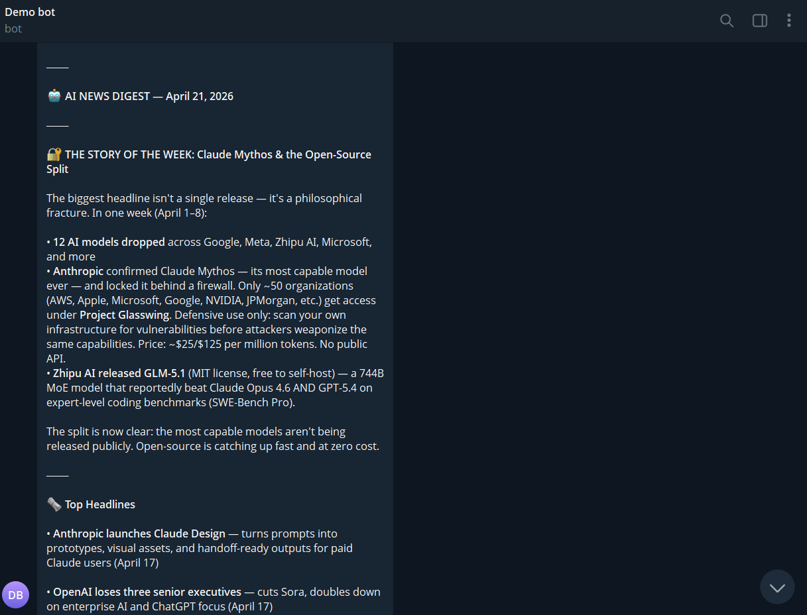

# Daily AI News Digest

Automated daily digest from 92 Karpathy-curated tech blogs, delivered to Telegram at 8 AM every morning. MiniMax M2.7 scores every article fetched in the last 24 hours and picks the 3 most significant stories.

## Architecture


## Demo



## How it works

```text
92 RSS Feeds → Fetch → Filter 24h → MiniMax M2.7 scores → Top 3 articles → Format → Telegram
```

1. `scripts/fetch_rss.py` fetches all feeds in parallel and keeps only articles published in the last 24 hours
2. `skill.py` sends the article list to MiniMax M2.7, which scores each one and returns the top 3 as structured JSON
3. Articles are grouped into categories (**Breaking**, **Important**, or **Notable**) and formatted as a Telegram message
4. Empty categories are omitted automatically


## Features
- Fetches articles from 92 Karpathy-curated RSS feeds in parallel
- Filters only articles published in the last 24 hours
- Uses MiniMax M2.7 to score and rank articles by significance
- Categorises top stories as Breaking, Important, or Notable
- Delivers formatted digest to Telegram at 8 AM daily via OpenClaw

## Tech Stack
**Models & Frameworks:**
- MiniMax M2.7: article scoring and ranking
- OpenClaw: skill orchestration and cron scheduling

**Libraries:**
- `feedparser`: RSS feed parsing
- `python-dotenv`: environment variable management
- `requests`: HTTP requests for RSS feed fetching


## Prerequisites

- [OpenClaw](https://openclaw.dev) installed
- MiniMax API key from [platform.minimax.io](https://platform.minimax.io)
- Telegram bot token from [@BotFather](https://t.me/BotFather) and a chat/channel ID

## Setup

### 1. Clone the Repository
```bash
git clone https://github.com/Sumanth077/Hands-On-AI-Engineering.git
cd Hands-On-AI-Engineering/ai_agents/daily-news-digest
```

### 2. Create Virtual Environment (Recommended)
```bash
python -m venv venv
venv\Scripts\activate  # Windows
source venv/bin/activate  # macOS/Linux
```

### 3. Install dependencies

```bash
pip install -r requirements.txt
```

### 4. Configure environment variables

```bash
cp .env.example .env
```

Open `.env` and fill in your credentials:

```env
MINIMAX_API_KEY=your_minimax_api_key_here
TELEGRAM_BOT_TOKEN=your_telegram_bot_token_here
TELEGRAM_CHAT_ID=your_telegram_chat_id_here
```

| Variable | Where to get it |
|---|---|
| `MINIMAX_API_KEY` | [platform.minimax.io](https://platform.minimax.io) |
| `TELEGRAM_BOT_TOKEN` | [@BotFather](https://t.me/BotFather) on Telegram |
| `TELEGRAM_CHAT_ID` | The ID of the channel or chat to deliver the digest to |

### 5. Onboard with OpenClaw

```bash
openclaw onboard
```

When prompted, select **MiniMax M2.7** as the model.

### 6. Add the skill to OpenClaw

Copy the skill folder to your OpenClaw workspace:

```bash
cp -r . ~/.openclaw/skills/daily-ai-news-digest
```

### 7. Schedule the daily run

```bash
openclaw cron add "0 8 * * *" skill.py
```

This schedules the digest to run every day at **08:00 UTC**. Adjust the cron expression to change the time. For example, `"0 7 * * 1-5"` schedules it for weekdays at 07:00 UTC.

## Running manually

```bash
python skill.py
```

## Output format

```text
🗞️ Daily AI Digest: April 1, 2026

🔴 BREAKING
🔴 Article Title: Summary sentence one. Sentence two.
Source: Blog Name | [Read more](https://...)

🟡 IMPORTANT
🟡 Article Title: Summary sentence one. Sentence two.
Source: Blog Name | [Read more](https://...)

🔵 NOTABLE
🔵 Article Title: Summary sentence one. Sentence two.
Source: Blog Name | [Read more](https://...)
```

## Project structure

```text
daily-ai-news-digest/
├── skill.py              # Main pipeline: fetch, score, format, send
├── scripts/
│   └── fetch_rss.py      # Parallel RSS fetcher with 24h date filter
├── sources.json          # 92 Karpathy-curated RSS feed sources
├── requirements.txt      # Python dependencies
├── .env.example          # Template for required environment variables
├── .env                  # Local credentials (not committed)
└── SKILL.md              # OpenClaw skill manifest
```

## Customisation

**Change the number of top articles**: edit the system prompt in `skill.py` and update the instruction from "top 3" to your preferred number.

**Change the lookback window**: the `--hours` argument in `fetch_articles()` defaults to 24. Pass a different value to cast a wider or narrower net.

**Add or remove sources**: edit `sources.json`. Each entry needs a `name`, `xmlUrl` (the feed URL), and `htmlUrl` (the site URL).

**Change the schedule**: update the cron expression in the `trigger` field of `SKILL.md` and re-register with `openclaw cron add`.
