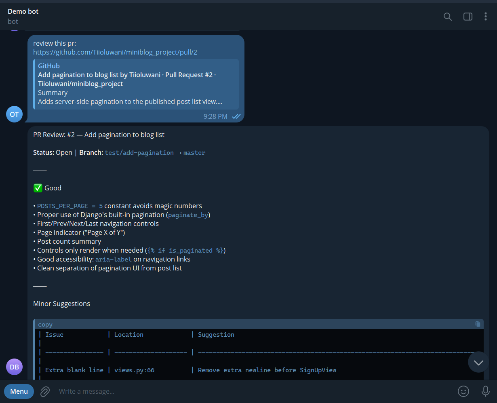

<a id="top"></a>

# 🦅 Eagle Eye

AI-powered GitHub PR review agent using [OpenClaw](https://openclaw.dev), MiniMax M2.7, and GitHub MCP. Triggered via Telegram.

---

## ✅ Prerequisites

- [OpenClaw](https://openclaw.dev) installed
- A Telegram bot, created via [@BotFather](https://t.me/BotFather)
- A GitHub Personal Access Token with repo and pull request scopes, created at [GitHub's token settings page](https://github.com/settings/tokens)

---

## 📸 Demo



---

## 📽️ Project Overview

**Eagle Eye** is a Telegram-triggered code review assistant that analyzes GitHub pull requests and delivers structured feedback directly to your chat. 

By leveraging the **MiniMax M2.7** reasoning model and the **GitHub MCP** server, it fetches PR diffs, identifies security vulnerabilities or bugs, and provides an overall quality rating. Critically, the agent acts as your co-pilot: it prepares the review, but **nothing is posted to GitHub without your explicit approval.**

---

## 🏗️ Project Structure

Understanding the layout of the Eagle Eye agent:

```text
.
├── docs/                   # Documentation assets
│   └── architecture.svg    # System architecture diagram
├── openclaw.json           # Your active configuration (Telegram, MCP)
├── openclaw.example.json   # Template for local configuration
├── README.md               # You are here
└── SOUL.md                 # 🧠 The agent's core identity and review logic
```

### 🧠 The SOUL (`SOUL.md`)
The `SOUL.md` file is the most important part of the agent. While traditional software hardcodes logic in scripts, Eagle Eye uses this "Soul" file to define its:
- **Identity & Tone**: How it speaks (professional, constructive, concise).
- **Review Criteria**: Specific focus on Security (XSS, Injection), Bugs (Race conditions, logic errors), and Best Practices.
- **Workflow**: The step-by-step instructions for fetching data, analyzing diffs, and formatting the Telegram response.

---

## ⚙️ How It Works


1. **Trigger**: You send a GitHub PR URL to your Telegram bot.
2. **Fetch**: The agent uses the **GitHub MCP Server** to securely pull the PR description and code diff.
3. **Analysis**: The **MiniMax M2.7** model processes the diff based on the instructions in `SOUL.md`.
4. **Draft**: A formatted review is sent to your Telegram chat with a summary and severity-coded findings.
5. **Approval**: You reply with `post` to publish it as a comment on GitHub, or `no` to discard it.

---

## 🚀 Setup

### 1. Run `openclaw onboard`

```bash
openclaw onboard
```

When prompted, select **MiniMax M2.7** as your model. OpenClaw will ask for your API key and store it securely in its auth profiles; **no need to put it in `openclaw.json`**.

### 2. Configure `openclaw.json`
Copy `openclaw.example.json` to `openclaw.json` and fill in your credentials (Telegram Bot Token and GitHub PAT).

### 3. Deploy to Workspace
Copy the project files into your OpenClaw skills directory:

**Windows:**
```powershell
xcopy . %USERPROFILE%\.openclaw\workspace\skills\eagle-eye\ /E /I
```

**macOS / Linux:**
```bash
cp -r . ~/.openclaw/workspace/skills/eagle-eye/
```

### 4. Start the Agent
Run the gateway to begin listening for messages:
```bash
openclaw gateway
```

---

## 📱 Usage

Simply paste a PR link into your Telegram chat:
> *Please review this: https://github.com/owner/repo/pull/42*

The agent will respond with the review and a prompt:
- Reply **`post`** to finalize the review on GitHub.
- Reply **`no`** to cancel.
- Reply with **instructions** (e.g., *"Make it more concise"*) to iterate on the draft.

---

## ⚠️ Known Limitations

- **Scope**: Does not see CI/CD logs or test results unless pasted into the chat.
- **Large PRs**: For very large changes, the agent prioritizes security and correctness.
- **Stateless**: Each Telegram session starts fresh; previous review context is not retained unless manually provided.

---

[Back to top](#top)
